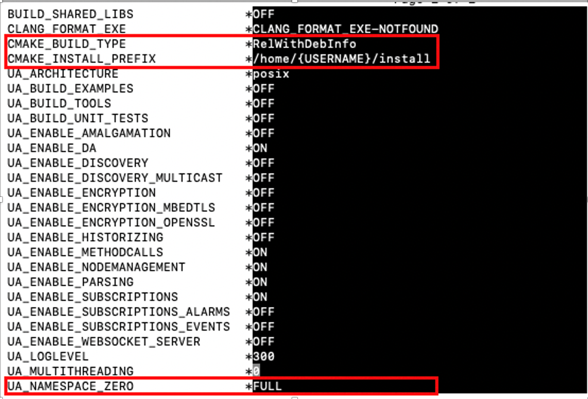
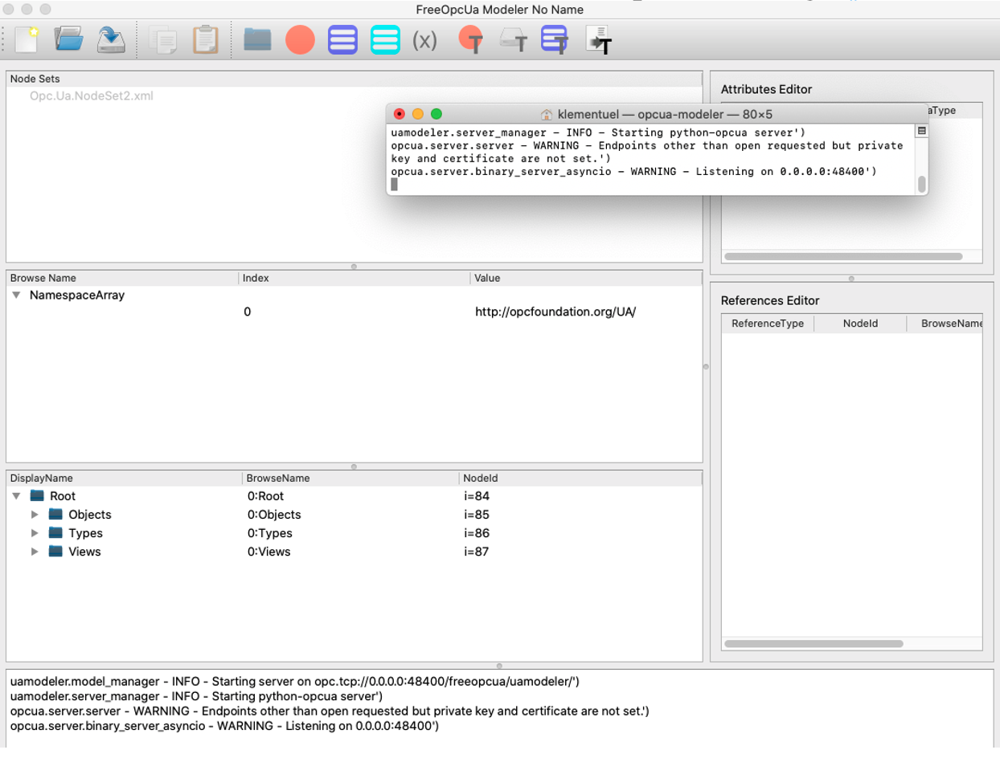

Einrichtung von OPC UA mit open62541\
auf einem Raspberry Pi 4

- [Einleitung](#einleitung)
- [Einrichtung des Raspberry Pi](#einrichtung-des-raspberry-pi)
	- [Voreinstellungen](#voreinstellungen)
	- [Update und Upgrade](#update-und-upgrade)
	- [OPC UA Nutzer und Hostname anpassen](#opc-ua-nutzer-und-hostname-anpassen)
	- [SSH](#ssh)
	- [Sicherheit](#sicherheit)
- [Open62541 SDK am Raspberry kompilieren](#open62541-sdk-am-raspberry-kompilieren)
	- [Erster Server mit OPC UA als Test](#erster-server-mit-opc-ua-als-test)
	- [Test-Server mit Client verbinden](#test-server-mit-client-verbinden)
- [Informationsmodellierung eines OPC UA-Servers](#informationsmodellierung-eines-opc-ua-servers)
	- [FreeOpcUa Modeler](#freeopcua-modeler)
- [Aus einem UANodeSet.xml den Source-Code erstellen](#aus-einem-uanodesetxml-den-source-code-erstellen)
	- [Erstellen der Main-Methode und erster Server -Test](#erstellen-der-main-methode-und-erster-server--test)
- [Methoden und Variable mit Logik verbinden](#methoden-und-variable-mit-logik-verbinden)
	- [Ändern der Server-Laufzeit-Routine](#ändern-der-server-laufzeit-routine)
	- [Variable](#variable)
	- [Methoden](#methoden)
	- [Modifizierte main.c](#modifizierte-mainc)
	- [Kompilieren und testen](#kompilieren-und-testen)
- [Fortgeschritten Erweiterungen](#fortgeschritten-erweiterungen)
	- [Callbacks für Variablen](#callbacks-für-variablen)
	- [Methoden mit Multithreading](#methoden-mit-multithreading)
	- [Browse](#browse)
- [Custom Cmake File](#custom-cmake-file)
- [OPC UA Server als Linux Service](#opc-ua-server-als-linux-service)
- [Git Repository](#git-repository)


# Einleitung

Diese Technische Dokumentation dient als Anleitung zur Einrichtung eines
OPC UA Servers auf einem Raspberry Pi4. Als Basis dient hierbei die Open
Source-Variante von OPC UA open62541. Um das Verständnis dieser
Dokumentation zu erhöhen, wird empfohlen, die dazugehörige
Bachelor-Arbeit zu lesen. Dort werden sehr viele Informationen aus den
Übungen von <https://opcua.rocks/> verarbeitet. Diese Seite bietet
ausführliche Informationen zu open62541 und den Arbeiten mit offiziellen
Informationsmodellen der OPC UA Fundation Als Grundvoraussetzung wird
folgendes gesetzt:

-   Raspberry Pi4 mit 2GB Ram

-   Unified Automation UA Expert\
    ([www.unified-automation.com/products/development-tools.html](www.unified-automation.com/products/development-tools.html))

-   Unified Automation UA Modeler\
    ([www.unified-automation.com/products/development-tools.html](www.unified-automation.com/products/development-tools.html))

-   FreeOpcUA Modeler
    ([github.com/FreeOpcUa/opcua-modeler](github.com/FreeOpcUa/opcua-modeler))

-   Raspberry Pi Imager
    ([www.raspberrypi.org/software/](www.raspberrypi.org/software/))

-   Für Windows Putty als SSH Client (<https://www.putty.org/>)

-   Cyberduck, um Zugriff via SSH auf Datei-System zu bekommen\
    (<https://cyberduck.io/download/>)

# Einrichtung des Raspberry Pi

Als ersten Schritt wollen wir den Raspberry Pi einrichten. Hierfür wird
mit dem Raspberry Pi Imager das aktuelle Raspberry OS (nicht Lite oder
Full) auf die SD Karte geschrieben. Wenn ein schon vorhandener
Raspberry benutzt wird, kann man im Kapitel 3 fortfahren. Da ab Kapitel
3 nur noch mit dem Terminal gearbeitet wird, kann man auch mit der OS
Lite Version ohne Desktop fortfahren.


Danach kann man die SD Karte in den Raspberry Pi einsetzen und ihn an
einen Monitor, eine Tastatur, eine Maus anschließen und ihn schließlich
mittels eines USB C-Netzkabels mit Spannung versorgen.

## Voreinstellungen

Nach dem Start wird man durch ein kleines Wizard geführt, um diverse
Einstellungen der Sprache und Lokalisierung, das Standard-Passwort des
Nutzers pi, Bildschirm und Wlan zu ändern. Falls es nach dem Wizard zu
einem Fehler kommt oder das Tastatur-Layout nicht stimmt, kann man dies
nach dem Neustart in den OS-Einstellungen ändern oder natürlich auch das
Wizard beenden und die Einstellungen manuell durchführen.

## Update und Upgrade

Nun wechseln wir im OS in das Terminal und geben den Befehl

``` {.Bash language="Bash"}
sudo apt update  #die Quellen des Paketmanagers aktualisieren
sudo apt upgrade #installierte Pakete auf den aktuellen Stand setzen
#Gegebenenfalls muss man das Installieren der Pakete mit Y Enter bestätigen
```

## OPC UA Nutzer und Hostname anpassen

Da es grundsätzlich nie ideal ist, auf einem bestehenden System bekannte
Nutzer für den Zugriff von außen zu haben, benötigen wir einen neuen
Benutzer. Außerdem wollen wir den hostname des Raspberry an unsere
Bedürfnisse anpassen, da dieser für das Auffin-den von Geräten im
Netzwerk nützlich ist. Hostname ändern:

``` {.Bash language="Bash"}
hostname #abrufen des aktuellen hostname
sudo hostname -b {neuerName} #ändern des hostname
hostname #prüfen, ob Änderung erfolgreich
sudo grep -lr „{alter hostname}” /etc/* #prüfen, ob der alte Host noch in anderen Konfiguratonsdateien verzeichnet ist

sudo nano /etc/{Dateiname}
#nach dem hostname suchen, ändern und mit ctrl x speichern, hier da-rauf achten, dass man keine Dateien ändern muss, wo in der Zeichenkette der hostname auftaucht(Bsp. raspi.list, hier findet man http.//archive.raspberrypi.org/debian/ das natürlich nicht ändern)
Außerdem muss man nicht die Keys von SSH ändern, diese erstellen wir gleich neu mit folgenden Befehlen

sudo rm /etc/ssh/ssh_host_* #alte Keys löschen
sudo dpkg-reconfigure openssh-server #neue Keys erstellen

sudo reboot #System-Neustart
```

Benutzer hinzufügen und Pi-Benutzer löschen:

``` {.Bash language="Bash"}
#Nutzer hinzufügen
sudo adduser {USERNAME}
#Nutzer-Rechte hinzufügen, am wichtigsten ist sudo
sudo usermod -a -G adm,dialout,cdrom,sudo,ssh,audio,video,plugdev,games,users,input,netdev,gpio,i2c,spi {USERNAME}
#Testen, ob man sich mit dem neuen User als Superuser einloggen kann
sudo su – {USERNAME}
#den pi-Nutzer löschen
sudo pkill -u pi
#Nicht wundern, da wir im Desktop als PI-Nutzer eingeloggt sind und diesen gerade löschten, werden wir abgemeldet und gefragt, ob wir uns als {USERNAME} Nutzer einloggen wollen
```

## SSH

Damit wir einen Fernzugriff auf den Raspberry bekommen, benötigen wir
SSH. Dies können wir im Terminal mit folgenden Befehlen aktivieren.

``` {.Bash language="Bash"}
sudo systemctl start ssh #ssh starten
sudo systemctl enable ssh #ssh Autostart nach dem boot Vorgang

systemctl status ssh #Status abfragen
systemctl is-enabled ssh #abfragen, ob Autostart aktiviert

ifconfig #damit sieht man die Einstellungen der Netzwerk Adpater, um sich für später die IP-Adresse (inet) des wlan0-Adpaters zu merken.
```

Nun können wir mit einem SSH Client auf den Raspberry zugreifen mit

``` {.Bash language="Bash"}
ssh {NUTZERNAME}@{IPADRESSE}
```

## Sicherheit

Da davon ausgegangen wird, dass der Raspberry zunächst im lokalen Netz
betrieben wird und wir während des Prototypings noch keine erhöhte
Sicherheit benötigen, werden keine weiteren Sicherheitseinstellungen
vorgenommen. Da aber später möglicherweise eine erhöhte Sicherheit
benötigt wird, wird hiermit auf die offizielle Seite von
<https://www.raspberrypi.org/documentation/configuration/security.md>
mit einer kleinen Guideline zu den Sicherheitseinstellungen, Firewall,
SSH, Nutzer usw. verwiesen.

# Open62541 SDK am Raspberry kompilieren 

Die folgenden benötigten Pakete müssen auf dem Raspberry installiert
werden. Einige Pakete sind bereits vorinstalliert.

``` {.Bash language="Bash"}
sudo apt install git build-essential gcc pkg-config cmake python

# Nützliche Extra-Pakete
sudo apt install cmake-curses-gui # ccmake UI
sudo apt install libmbedtls-dev # Verschlüsselungs-Optionen
sudo apt install check libsubunit-dev # unit tests
sudo apt install python-sphinx graphviz #für Dokumentationen
sudo apt install python-sphinx-rtd-theme # Dokumentstyle-Erweiterung
```

Download des Source Codes

``` {.Bash language="Bash"}
#Repository Clone
git clone https://github.com/open62541/open62541.git ~/open62541
#Gehen in den Ordner
cd ~/open62541 #Submodule Laden
git submodule update --init --recursive
```

Kompilierung vorbereiten mit CCmake

``` {.Bash language="Bash"}
#Pfad erstellen und in Pfad gehen
mkdir ~/open62541/build && cd ~/open62541/build
#Öffne ccmake UI aus den Informationen im unteren Pfad
ccmake ..
```

Nun öffnet sich die UI. In dieser betätigen wir zunächst die Taste „c",
um die Konfigurations\"\"-\"\"Seite zu öffnen. Wie in zu sehen, ändern
wir den `CMAKE_BUILD_TYPE` gegen `RelWithDebInfo` (Release Version mit
Debug-Informationen), das `CMAKE_INSTALL_PREFIX` gegen den
Installationspfad und den `UA_NAMESPACE_ZERO` gegen `UA_NAMESPACE_FULL`
(Volle „namespace zero"-Erstellung von den offiziellen
XML-Definitionen.) . Nachdem wir fertig sind, beenden wir die
Einstellungen mit der Taste „c" und erstellen ein make file mit der
Taste „g". Danach bauen wir den Code mit dem Befehl

``` {.Bash language="Bash"}
make -j #das kann einige Zeit dauern
make install #den Build ins vorher gesetzte Installationsverzeichnis verschieben
```



Anmerkung: Entgegen der Empfehlung kann es gerade am Anfang Sinnvollsein
nicht den NamepsaceFull zu benutzen, sondern Reduced. Dies spart gerade
am Anfang beim Ausprobieren viel Zeit beim Kompilieren, wenn man auf
einige vordefinierte Typen verzichten kann. Ein Überblick der
beinhalteten Typen vom Namespace Reduced findet man hier:
<https://github.com/open62541/open62541/blob/master/tools/schema/&Opc.Ua.NodeSet2.Reduced.xml>

## Erster Server mit OPC UA als Test

Nun wollen testen, ob alles funktioniert. Deshalb kopieren wir uns ein
Beispiel eines Ser-vers und erstellen daraus einen lauffähigen Server
auf dem Raspberry

``` {.Bash language="Bash"}
mkdir ~/firstTest-Server
cp ~/open62541/examples/tutorial_server_firststeps.c ~/firstTestServer/firstTestServer.c
cd ~/firstTestServer/

#Bauen des TestServers
gcc -std=c99 -flto=1 -I$HOME/install/include -L$HOME/install/lib firstTestServer.c -lopen62541 -lmbedtls -lmbedx509 -lmbedcrypto -o firstTestServer
```

Dies kann über eine Stunde dauern. Was wurde im gcc-Befehl gemacht:

-   `std=c99`\
    gcc benutzt den C99-Kompilierer

-   `flto=1`\
    limitiert die parallel ablaufenden Linking-Jobs auf eins

-   `-I{PFAD}`\
    fügt den vorhin gebauten Include-Pfad hinzu

-   `-L{PFAD}`\
    fügt den vorhin gebauten Library-Pfad hinzu

-   `$Home`\
    Verweis auf das home-Verzeichnis des aktuellen Nutzers ähnlich wie
    der Befehl `~/` nur universeller einsetzbar.

-   `firstTest-Server.c`\
    C-Datei, die gebaut werden soll

-   `-lopen62541`\
    open62541 Library

-   `-lmbedtls -lmbedx509 -lmbedcrypto`\
    für Kryptographie

-   `-o firstTestServer`\
    Ausgabe-Datei

## Test-Server mit Client verbinden

Nun können wir den Server testen, indem wir die gerade erstellte Datei
ausführen

``` {.Bash language="Bash"}
./firstTestServer
```


In sieht man den Server, der sich gestartet hat sowie die Adresse mit
Port, unter der er erreichbar ist. Nun starten wir auf unserem Computer
die Software UA Expert und fügen, wie in zu sehen ist, den gerade
gestarteten Server hinzu.

{#fig:uaexpertclient
width="1\\linewidth"}

Danach sieht man in die Datenstruktur des erstellten Test-Servers wie in

{#fig:uaexpertstrukt
width="0.6\\linewidth"}

# Informationsmodellierung eines OPC UA-Servers

Nachdem jetzt die Grundlagen geschaffen sind, einen lauffähigen OPC
UA-Server zu erstellen, wird in diesem Kapitel erklärt, wie man mit
Hilfe des FreeOpcUa Modeler ein UANodeSet.xml für seine Server-Struktur
erstellt. Dies wird im nächsten Kapitel benö-tigt, um einen Server mit
einem eigenen Nodeset zu bauen. Eine detaillierte Erklärung zu
Informationsmodellen und auch noch andere Wege zur Erstellung seiner
Informationsmodelle findet man unter <https://opcua.rocks/>

## FreeOpcUa Modeler

Das Programm können wir entweder direkt auf dem Raspberry installieren
und ausführen oder auch auf dem Projekt-Rechner. Nachdem wir diesen
gestartet haben, läuft im Hintergrund auch schon automatisch ein OPC
UA-Server, mit dem man sich verbinden kann. Dieser Server läuft auf dem
Open Source Projekt FreeOPC UA. Es soll auch möglich sein, hier direkt
einen open62541-Server anzusprechen. Da wir dies in unserem Beispiel
nicht benötigten, wurde das nicht getestet. Ein Blick nach dem Start im
Terminal zeigt auch hier die generierte opc-Adresse mit Port, wie in zu
sehen. 0.0.0.0 bedeutet, dass dieser am local Host erreichbar ist. Um
sich also mit ihm über einen anderen Rechner im Netzwerk zu verbinden,
wird die IP-Adresse des Netzwerk-Adapters benötigt!



Nun beginnen wir mit der Modellierung eines einfachen Beispiels: Wir
haben einen Motor, der über das Datenmodell ansteuerbar sein und seinen
Status anzeigen soll. Es kann auch sein, dass noch ein Motor hinzukommt.
Als erstes benötigen wir einen Namespace, wo wir diese Typen, Objekte
später zuordnen. Wie in zu sehen, wurde der Namespace 1 mit
http.//motoren.test/UA/ erstellt.


Da es also sein kann, dass wir mehrere Motoren benötigen, erstellen wir
als Erstes einen Motor-Typ, der ein Objekt eines Motors darstellt und
beliebig oft als Objekt wiederverwendet werden kann. In ist der Ablauf
einer Objekt-Typ-Erstellung zu sehen.


Nun werden dem Objekt-Typ die nötigen Informationen gegeben. Im Beispiel
wurden 3 Variablen erstellt, die der Nutzer nur lesen kann (Speed,
Running, Direction) und 2 Methoden Control mit Eingangs- und
Ausgangs-Variablen und Emergency Stop ohne Variablen


Im nächsten Schritt wird aus dem erstellten Typ ein Objekt erstellt.


Und schon kann im UA Expert Client die Struktur validiert werden.


Natürlich führt der Aufruf einer Methode, wie auch zu sehen ist, noch zu
einem Fehler, da noch keine Logik in den Methoden steckt. Nun wird das
Projekt noch abgespeichert, wodurch sich auch das benötigte UANodeSet
File als XML Datei generiert.


Anmerkung: Es ist nicht nötig, hier schon Objekte anzulegen, denn diese
kann man auch später erstellen. Wenn man allerdings schon weiß, was man
braucht, ist es nützlich, diese gleich zu modellieren. Des Weiteren ist
es ebenso möglich, aus einem Typ Objekt-Varianten zu erstellen, wenn man
z.B. danach noch Variablen hinzufügt, um einzelne Objekte zu
spezialisieren.

# Aus einem UANodeSet.xml den Source-Code erstellen

Im Grunde ist dies recht einfach, da im Git Reprository von open62541
ein python skript hinterlegt ist, das die ganze Arbeit erledigt. Dies
kann man also auch direkt am Raspberry erledigen oder auch auf seinem
Projekt-Computer. Hierfür muss nun das Skript mit folgenden Zusätzen
ausgeführt werden.

``` {.Bash language="Bash"}
python ~/open62541/tools/nodeset_compiler/nodeset_compiler.py 
--types-array=UA_TYPES --existing ~/open62541/deps/ua-nodeset/Schema/Opc.Ua.NodeSet2.xml --xml MotorSteuerungNodeSet.xml MotorSteuerung
```

Kurze Erklärung zu den einzelnen Zusätzen

``` {.Bash language="Bash"}
# python skript, das ausgeführt werden muss
python ~/open62541/tools/nodeset_compiler/nodeset_compiler.py
# als was sollen die Typen exportiert werden
--types-array=UA_TYPES
# auf welchem Schema baut das Ganze auf
--existing ~/open62541/deps/ua-nodeset/Schema/Opc.Ua.NodeSet2.xml
#Pfad zum erstellten NodeSet2.xml
--xml MotorSteuerungNodeSet.xml
#Ausgabe-Name, aus diesem werden dann die benötigte c- und h-Datei erstellt
MotorSteuerung
```

Wenn das Ganze erfolgreich war, sollte es wiefolgt aussehen. Im oberen
Teil sieht man die Ausgabe des Skripts, im unteren Teil die im Ordner
erstellten c- und h-Dateien.


## Erstellen der Main-Methode und erster Server -Test

In dem vorhergehenden Kapitel wurde der Source Code aus einem
Informationsmodell erstellt. Nun wollen wir das Ganze durch das
Erstellen einer Main-Methode ergänzen, die als Startpunkt für den Server
dient. Dazu erstellen wir in einem beliebigen Editor mit folgendem
Inhalt eine main.c-Datei und speichern diese bei unserem Source Code ab.

``` {.Bash language="Bash"}
#include <open62541/plugin/log_stdout.h>
#include <open62541/server.h>
#include <open62541/server_config_default.h>
#include <signal.h>
#include <stdlib.h>
#include "MotorSteuerung.h"

UA_Boolean running = true;


static void stopHandler(int sign) {
	UA_LOG_INFO(UA_Log_Stdout, UA_LOGCATEGORY_SERVER, "received ctrl-c");
	running = false;
}

int main(int argc, char** argv) {
	signal(SIGINT, stopHandler);
	signal(SIGTERM, stopHandler);
	
	UA_Server *server = UA_Server_new();
	UA_ServerConfig_setDefault(UA_Server_getConfig(server));
	UA_StatusCode retval;
	/* create nodes from nodeset */
	if(MotorSteuerung(server) != UA_STATUSCODE_GOOD) {
		UA_LOG_ERROR(UA_Log_Stdout, UA_LOGCATEGORY_SERVER,
		"Could not add the MotorSteuerung nodeset. "
		"Check previous output for any error.");
		retval = UA_STATUSCODE_BADUNEXPECTEDERROR;
	} else {
		// Do some additional stuff with the nodes
		// this will just get the namespace index,
		//since it is already added to the server
		UA_UInt16 nsIdx = UA_Server_addNamespace(server, "http://helloWorld.com/UA/");
		// UA_MOTOR1_RUNNING_BOOL = 2010
		UA_NodeId testInstanceId = UA_NODEID_NUMERIC(nsIdx, 2010);
		UA_LOG_INFO(UA_Log_Stdout, UA_LOGCATEGORY_SERVER,
		"Motor1 Bool Running is in ns=%d;id=%d",
		testInstanceId.namespaceIndex, testInstanceId.identifier.numeric);
		retval = UA_Server_run(server, &running);
	}
	UA_Server_delete(server);
	return retval == UA_STATUSCODE_GOOD ? EXIT_SUCCESS : EXIT_FAILURE;
```

Wie man erkennen kann, wird in der Main-Methode ein Server-Objekt mit
den Standard- Einstellungen erstellt. Die Variable retval dient dazu,
nach dem Beenden den Staus-Code des Servers zurückzugeben, als ob der
Server wegen eines Fehlers beendet oder absicht-lich beendet wurde.
Danach fragen wir in einem If-Block ab, ob das Erstellen des neuen
MotorSteuerung No-deBlocks erfolgreich war. Wenn nicht, geben wir im Log
einen Fehler aus. Wenn das erfolgreich war, können wir entweder gleich
zur Zeile mit US_server_run übergehen, oder aber - wie in unserem Fall -
wollen wir prüfen, ob eine Node-ID korrekt abgerufen wird. Dies wird in
den Log File ausgegeben. Nun können wir wieder mit unserem leicht
abgeänderten gcc-Befehl den Server-Code bauen.

``` {.Bash language="Bash"}
gcc -std=c99 -flto=1 -I$HOME/install/include -L$HOME/install/lib main.c MotorSteuerung.c -lopen62541 -lmbedtls -lmbedx509 -lmbedcrypto -o MotorSteuerung
```

Augenmerk sollte hier auf das Hinzufügen der main.c und der
implementierten Klassen in diese MotorSteuerung.c gelegt werden. Nachdem
der Server erstellt wurde, können wir ihn nun mit

``` {.Bash language="Bash"}
./MotorSteuerung
```

starten und prüfen, ob im Log auch unsere Abfrage der Node-ID ausgegeben
wird.


Wenn ja, können wir noch prüfen, ob im UA Expert Client alles
erwartungsgemäß angezeigt wird

# Methoden und Variable mit Logik verbinden

Nachdem nun ein funktionierender Server-Code vorliegt, wird mit dem
Anlegen der Logik für Variable und Methoden begonnen.

## Ändern der Server-Laufzeit-Routine

Derzeit wird der Server mit

``` {.Bash language="Bash"}
UA_Server_run(server, &running);
```

gestartet. Dieser Aufruf wird solange durchgeführt, bis die Variable
running auf false gesetzt wird. Wenn wir allerdings nun während der
Ausführung des Servers noch andere Aktionen ausführen wollen, z.B. das
lesen eines Sensors und schreiben einer OPC UA Variable während des
Vorgangs müssen wir die Server Routine ein wenig verändern (im Kapitel
kommen wir allerdings zu noch einer anderen Möglichkeit). Dies tun wir
indem diese Zeile aus der main.c entfernen und den Code mit Folgendem
erweitern.

``` {.Bash language="Bash"}
retval = UA_Server_run_startup(server);
//https://open62541.org/doc/current/server.html#server-lifecycle
if(retval != UA_STATUSCODE_GOOD) {
	UA_Server_delete(server);
	return retval;
}
while(running == true)
{
	//Server Routine
	//https://open62541.org/doc/current/server.html#server-lifecycle
	UA_Server_run_iterate(server, true);
}

return retval == UA_STATUSCODE_GOOD ? EXIT_SUCCESS : EXIT_FAILURE;
```

Hier sieht man, dass wir dem Server zunächst die Startup-Routine
durchlaufen lassen, prüfen, ob dies erfolgreich war und dann eine
while-Schleife starten, in der wir bei jedem Durchlauf einmal die
Server-Routine durchlaufen.

## Variable

Um nun z.B. in der while-Schleife jede Sekunde den speed um 1 zu erhöhen
und alle 5 Sekunden den Zustand des bool running zu ändern, ergänzen wir
den Code folgendermaßen. Wichtig: Hierfür muss noch `#include <time.h>`
hinzugefügt werden.

``` {.Bash language="Bash"}
int timestampM1Running = time(0) + 2;
int timestampM1Speed = time(0) + 1;
//https://open62541.org/doc/current/types.html
UA_Boolean m1running = false;
UA_Int16 m1speed = 0;
while(running == true)
{
	//Server Routine https://open62541.org/doc/current/server.html#server-lifecycle
	UA_Server_run_iterate(server, true);
	
	//Multi Use Variables for Update
	int time_now = time(0);
	UA_Variant value;
	
	//Update Variable Running every 2s
	if(time_now > timestampM1Running)
	{
		timestampM1Running = time_now + 2;
		m1running = m1running ? false : true;
		//https://open62541.org/doc/current/plugin_log.html
		UA_LOG_INFO(UA_Log_Stdout, UA_LOGCATEGORY_USERLAND,
		"New Motor 1 Running Bool: %s",m1running ? "True" : "False");
		//https://open62541.org/doc/current/types.html#generated-data-type-definitions
		//https://open62541.org/doc/current/types.html#variant
		UA_Variant_setScalar(&value, &m1running,&UA_TYPES[UA_TYPES_BOOLEAN]);
		
		//https://open62541.org/doc/current/server.html#reading-and-writing-node-attributes	
		UA_Server_writeValue(server, UA_NODEID_NUMERIC(nsIdx, 2010), val-ue);
	}
	
	//Update Variable Speed every 1s
	if(time_now > timestampM1Speed)
	{
		timestampM1Speed = time_now + 1;
		m1speed++;
		UA_LOG_INFO(UA_Log_Stdout, UA_LOGCATEGORY_USERLAND,
		"New M1 Speed int: %d", m1speed);
		UA_Variant_setScalar(&value, &m1speed,  &UA_TYPES[UA_TYPES_INT16]);
		UA_Server_writeValue(server, UA_NODEID_NUMERIC(nsIdx, 2011), val-ue);
	}
}

return retval == UA_STATUSCODE_GOOD ? EXIT_SUCCESS : EXIT_FAILURE;
```

Im Code sind auch die Verweise verzweigt, wo man dies in der
Dokumentation findet. Wichtig ist zu wissen, dass zum Schreiben einer
Variable das Erstellen einer Variante nötig ist. In dieser werden später
der gewünschte Wert und die Information des Datentyps temporär
abgespeichert und zwar mit der Function `UA\_Variant\_setScalar`. Diese
Variante kann man dann mit der Funktion `UA\_Server\_writeValue`
schreiben, die einen Pointer auf dem Server benötigt, die nötige Node-ID
und die soeben erstellte Variante.

## Methoden

Methoden benötigen eine Callback-Funktion. Wir erstellen diese vor der
Main-Methode exemplarisch für die Methode Control.

``` {.Bash language="Bash"}
static UA_StatusCode
ControlMethodCallback(UA_Server *server,
const UA_NodeId *sessionId, void *sessionHandle,
const UA_NodeId *methodId, void *methodContext,
const UA_NodeId *objectId, void *objectContext,
size_t inputSize, const UA_Variant *input,
size_t outputSize, UA_Variant *output) {
	//Handle Input
	UA_Int16 speed_in = *(UA_Int16*)input[0].data;
	UA_Int16 distance_in = *(UA_Int16*)input[1].data;
	UA_Boolean direction_in = *(UA_Boolean*)input[2].data;
	
	//Handle Direction and set for test the return Value to direction value
	UA_Boolean ret_val = direction_in;
	UA_Variant value;
	UA_Variant_setScalar(&value, &ret_val, &UA_TYPES[UA_TYPES_BOOLEAN]);
	UA_Server_writeValue(server, UA_NODEID_NUMERIC(nsIdx, 2012), value);
	
	//Return the Value to Methode Output
	UA_Variant_setScalarCopy(output, &ret_val, &UA_TYPES[UA_TYPES_BOOLEAN]);
	
	//End Methode
	UA_LOG_INFO(UA_Log_Stdout, UA_LOGCATEGORY_SERVER, "Control was called");
	return UA_STATUSCODE_GOOD;
}
```

Um zu sehen, in welcher Reihenfolge die Input-Parameter abzurufen sind,
kann man ei-nen Blick in sein Modell werfen. Wie in Abbildung zu sehen,
kann man im Attributes Editor die Argumente unter Values identifizieren.


Damit kann man dann lokale Variable schreiben und seine Methoden Logic
durchführen. Wir schreiben in diesem Fall einfach nur den Input
Direction direkt in die Server Variable Direction und ändern damit auch
je nach dem die output-Variable mit `UA\_Variant\_setScalarCopy`.

Im nächsten Schritt müssen wir der Methode noch sagen, dass sie diesen
ein Callback aufrufen soll. Dies geschieht mit folgender Erweiterung in
der Main-Methode.

``` {.Bash language="Bash"}
//Set Callback for M1 Control https://open62541.org/doc/1.2/server.html#method-callbacks
UA_Server_setMethodNode_callback(server,
UA_NODEID_NUMERIC(nsIdx, 2013),
&ControlMethodCallback);
```

Diesen Code-Teil kann man nach dem Server-Startup implementieren.

## Modifizierte main.c

Hier findet man noch die gesamten Änderungen der main.c zusammengefasst.

``` {.Bash language="Bash"}
#include <open62541/plugin/log_stdout.h>
#include <open62541/server.h>
#include <open62541/server_config_default.h>
#include <signal.h>
#include <stdlib.h>
#include "MotorSteuerung.h"

#include <time.h>

UA_Boolean running = true;
UA_UInt16 nsIdx; //Namespace  "http://helloWorld.com/UA/"

static UA_StatusCode
ControlMethodCallback(UA_Server *server,
const UA_NodeId *sessionId, void *sessionHandle,
const UA_NodeId *methodId, void *methodContext,
const UA_NodeId *objectId, void *objectContext,
size_t inputSize, const UA_Variant *input,
size_t outputSize, UA_Variant *output) {
	//Handle Input
	UA_Int16 speed_in = *(UA_Int16*)input[0].data;
	UA_Int16 distance_in = *(UA_Int16*)input[1].data;
	UA_Boolean direction_in = *(UA_Boolean*)input[2].data;
	
	//Handle Direction and set for test the return Value to direction value
	UA_Boolean ret_val = direction_in;
	UA_Variant value;
	UA_Variant_setScalar(&value, &ret_val, &UA_TYPES[UA_TYPES_BOOLEAN]);
	UA_Server_writeValue(server, UA_NODEID_NUMERIC(nsIdx, 2012), value);
	
	//Return the Value to Methode Output
	UA_Variant_setScalarCopy(output, &ret_val, &UA_TYPES[UA_TYPES_BOOLEAN]);
	
	//End Methode
	UA_LOG_INFO(UA_Log_Stdout, UA_LOGCATEGORY_SERVER, "Control was called");
	return UA_STATUSCODE_GOOD;
}

static void stopHandler(int sign) {
	UA_LOG_INFO(UA_Log_Stdout, UA_LOGCATEGORY_SERVER, "received ctrl-c");
	running = false;
}

int main(int argc, char** argv) {
	signal(SIGINT, stopHandler);
	signal(SIGTERM, stopHandler);
	
	UA_Server *server = UA_Server_new();
	UA_ServerConfig_setDefault(UA_Server_getConfig(server));
	UA_StatusCode retval;
	/* create nodes from nodeset */
	if(MotorSteuerung(server) != UA_STATUSCODE_GOOD) {
		UA_LOG_ERROR(UA_Log_Stdout, UA_LOGCATEGORY_SERVER, "Could not add the Motor-Steuerung nodeset. "
		"Check previous output for any error.");
		retval = UA_STATUSCODE_BADUNEXPECTEDERROR;
	} else {
		// Do some additional stuff with the nodes
		// this will just get the namespace index, since it is already added to the server
		nsIdx = UA_Server_addNamespace(server, "http://helloWorld.com/UA/");
		// UA_MOTOR1_RUNNING_BOOL = 2010
		UA_NodeId testInstanceId = UA_NODEID_NUMERIC(nsIdx, 2010);
		UA_LOG_INFO(UA_Log_Stdout, UA_LOGCATEGORY_SERVER, "Motor1 Bool Running is in ns=%d;id=%d",
		testInstanceId.namespaceIndex, testIn-stanceId.identifier.numeric);
		
	}
	//
	retval = UA_Server_run_startup(server);
	//Set Callback for M1 Control https://open62541.org/doc/1.2/server.html#method-callbacks
	UA_Server_setMethodNode_callback(server,
	UA_NODEID_NUMERIC(nsIdx, 2013),
	&ControlMethodCallback);
	
	//https://open62541.org/doc/current/server.html#server-lifecycle
	if(retval != UA_STATUSCODE_GOOD) {
		UA_Server_delete(server);
		return retval;
	}
	
	int timestampM1Running = time(0) + 2;
	int timestampM1Speed = time(0) + 1;
	//https://open62541.org/doc/current/types.html
	UA_Boolean m1running = false;
	UA_Int16 m1speed = 0;
	while(running == true)
	{
		//Server Routine https://open62541.org/doc/current/server.html#server-lifecycle
		UA_Server_run_iterate(server, true);
		
		//Multi Use Variables for Update
		int time_now = time(0);
		UA_Variant value;
		
		//Update Variable Running every 2s
		if(time_now > timestampM1Running) {
			timestampM1Running = time_now + 2;
			m1running = m1running ? false : true;
			//https://open62541.org/doc/current/plugin_log.html
			UA_LOG_INFO(UA_Log_Stdout, UA_LOGCATEGORY_USERLAND, "New Motor 1 Running Bool: %s",
			m1running ? "True" : "False");
			//https://open62541.org/doc/current/types.html#generated-data-type-definitions
			//https://open62541.org/doc/current/types.html#variant
			UA_Variant_setScalar(&value, &m1running,  &UA_TYPES[UA_TYPES_BOOLEAN]);
			
			//https://open62541.org/doc/current/server.html#reading-and-writing-node-attributes
			UA_Server_writeValue(server, UA_NODEID_NUMERIC(nsIdx, 2010), value);
		}
		
		//Update Variable Speed every 1s
		if(time_now > timestampM1Speed) {
			timestampM1Speed = time_now + 1;
			m1speed++;
			UA_LOG_INFO(UA_Log_Stdout, UA_LOGCATEGORY_USERLAND, "New M1 Speed int: %d",
			m1speed);
			UA_Variant_setScalar(&value, &m1speed,  &UA_TYPES[UA_TYPES_INT16]);
			UA_Server_writeValue(server, UA_NODEID_NUMERIC(nsIdx, 2011), value);
		}
	}
	
	return retval == UA_STATUSCODE_GOOD ? EXIT_SUCCESS : EXIT_FAILURE;
}
```

## Kompilieren und testen

Nun kann der Code wie im Kapitel 6 kompiliert und getestet werden.

In UA Expert kann man sich die Variablen in das Data Access View-Fenster
ziehen und beobachten, wie sich der Wert ändert. Die Methode kann mit
einem rechten Mausklick aufgerufen werden, danach kann man die
Input-Parameter setzen und mit Call den Abruf erledigen. Hier sind nun
die Änderungen der Direction und Success zu beobachten. In sieht man
einen erfolgreichen Methoden-Aufruf.


# Fortgeschritten Erweiterungen

In diesem Kapitel wollen wir nur auf weitere Möglichkeiten eingehen, wie
man mit Variablen vor oder nach dem Lesen bzw. Schreiben Aktionen
auslöst, wie man Methoden, die durch lange Operationen den Server
blockieren würden, asynchron bekommt oder die Möglichkeit die
Schematische Struktur seines Servers zu durchsuchen ohne die NodeID´s
einzelner Objekte zu kennen. Hierzu dient uns ein Beispiel aus der
Bachelor Arbeit des Umsetzungsteils des PaintingStationBelt. Dieses
Beispiel ist vom Aufbau schon ein wenig komplexer in seiner Strukturiert
um allerdings auch die Übersicht zu vereinfachen.


In sieht man dazu auch eine Übersicht des OPC UA Informationsmodels,
allerdings nicht in der empfohlenen Schematischen Modellierung der OPC
UA Fundation, da dies in der Bachelorarbeit mit SysML modelliert wurde.


## Callbacks für Variablen

Wie schon bei den Methoden ist es möglich Callbacks für Variablen zu
setzen. Entweder das diese eine Aktion auslösen, bevor sie gelsen
werden, oder nachdem sie beschrieben wurden. Im Beispiel wollen wir nun
das nach dem schreiben der Variable, der Status eine Server Log
Nachricht ausgibt. Dazu schreiben wir als erstes eine passende Funktion

``` {.objectivec language="C"}
void 
	Callbacks_AfterWrite_State(UA_Server *server,
	const UA_NodeId *sessionId, void *sessionContext,
	const UA_NodeId *nodeId, void *nodeContext,
	const UA_NumericRange *range, const UA_DataValue *data)
	{
		UA_LOG_INFO(UA_Log_Stdout, UA_LOGCATEGORY_SERVER, "State has Changed");
	}        
```

nun müssen wir dem Server noch das Callback zuordnen

``` {.objectivec language="C"}
/*Create and set the appropriate methods in the Callback variable. Important if you don't assign a function you have to set NULL, otherwise unexpected pointer errors can occur.*/
	UA_ValueCallback callback;
	callback.onRead = NULL;
	callback.onWrite = Callbacks_AfterWrite_State;
	//Set the callback variable to the NodeID
	UA_Server_setVariableNode_valueCallback(server, 
	variable_State,
	callback);
```

Damit ist das ganze schon erledigt und einsatzbereit.

## Methoden mit Multithreading

Man kann sich sicher Vorstellen, dass es auch Callbacks gibt die den
Server blockieren können, da diese eine gewisse Zeit benötigen um zu
einem Ergebnis zu kommen. Wie z.B. in meiner Bachelorarbeit. Hier wurden
Python Scripts von Methoden aufgerufen, die z.B. im Fall von dem
PaintingStationBelt gut 10s für einen Aufruf benötigen. In dieser Zeit
kann ein Client keine Variablen schreiben oder lesen, das natürlich dann
zu Fehlern führen würde. Zum Glück gibt es bei open62541 SDK die Option
Multithreading zu aktivieren. Dazu müsst ihr das SDK mit der
entsprechenden Option im ccmake unter `UA\_Multithreading = 100` setzen
und neu bauen. Der Rest bleibt gleich wie in beschrieben

Beginnend im main.c File musste man dann folgendes erweitern in der
\#Include Sektion:

``` {.objectivec language="C"}
#ifndef WIN32
	#include <pthread.h>
	#define THREAD_HANDLE pthread_t
	#define THREAD_CREATE(handle, callback) pthread_create(&handle, NULL, callback, NULL)
	#define THREAD_JOIN(handle) pthread_join(handle, NULL)
	#define THREAD_CALLBACK(name) static void * name(void *_)
	#else
	#include <windows.h>
	#define THREAD_HANDLE HANDLE
	#define THREAD_CREATE(handle, callback) { handle = CreateThread( NULL, 0, callback, NULL, 0, NULL); }
	#define THREAD_JOIN(handle) WaitForSingleObject(handle, INFINITE)
	#define THREAD_CALLBACK(name) static DWORD WINAPI name( LPVOID lpParam )
	#endif
```

Und mit zwei Funktionen vor der main Funktion erweitern.

``` {.objectivec language="C"}
THREAD_CALLBACK(ThreadWorker) {
	while(running) {
		UA_LOG_INFO(UA_Log_Stdout, UA_LOGCATEGORY_SERVER,
		"Try to dequeue an async operation");
		const UA_AsyncOperationRequest* request = NULL;
		void *context = NULL;
		UA_AsyncOperationType type;
		if(UA_Server_getAsyncOperationNonBlocking(server, &type, &request, &context, NULL) == true) {
			UA_LOG_INFO(UA_Log_Stdout, UA_LOGCATEGORY_SERVER, "AsyncMethod_Testing: Got entry: OKAY");
			UA_CallMethodResult response = UA_Server_call(server, &request->callMethodRequest);
			UA_Server_setAsyncOperationResult(server, (UA_AsyncOperationResponse*)&response,
			context);
			UA_LOG_INFO(UA_Log_Stdout, UA_LOGCATEGORY_SERVER, "AsyncMethod_Testing: Call done: OKAY");
			UA_CallMethodResult_clear(&response);
		} else {
			/* not a good style, but done for simplicity :-) */
			sleep(5);
		}
	}
	return 0;
}

/* This callback will be called when a new entry is added to the Callrequest queue */
static void
TestCallback(UA_Server *server) {
	UA_LOG_INFO(UA_Log_Stdout, UA_LOGCATEGORY_SERVER,
	"Dispatched an async method");
}
```

Das war schon der schwierigste Teil, im nächsten Schritt fügen wir in
der Callback.c Datei noch den Eintrag hinzu, dass dieses Callback
Asynchron ausgeführt werden muss.

``` {.objectivec language="C"}
UA_Server_setMethodNode_callback(server,
methode_Start,
&Callbacks_Methode_Start);
UA_Server_setMethodNodeAsync(server, methode_Start, UA_TRUE);
```

Nun kann man die Methoden Asynchron aufrufen.

## Browse

Ein wichtiger Grund, warum man überhaupt ein Informationsmodel braucht
ist die Möglichkeit Schematisch Objekte abzufragen. also das ich wie in
einer Ordner Struktur Stück für Stück nach dem richtigen Eintrag suchen
kann. Dazu hatte ich ihn der Bachelorarbeit eine kleine Helfer Funktion
geschrieben, mit der man dann auch Fehler einer Anfrage Filtern kann
bzw. auch die erfolgreichen Abfragen im Server Log sieht.

Als erstes wird ein Array, das die tiefer der Abfrage entspricht,
angelegt als Typ UA_Qualified Name. In diesem Fall suchen wir in unserem
Hauptobjekt den Ordner Control und danach die Methode Test

``` {.objectivec language="C"}
UA_QualifiedName targetNameArr[2] = {UA_QUALIFIEDNAME(*_callbackNsIdx, "Control"), 
UA_QUALIFIEDNAME(*_callbackNsIdx, "Test"), 
```

Danach müssen wir definieren, von wo wir anfangen zu suchen, also das
Parent Objekt in dem Fall PaintingStationBelt, hier wissen wir die
NodeID, natürlich ist auch eine Abfrage aus dem Root Ordner möglich,
also wenn selbst die NodeID des Hauptobjekt unbekannt ist.

``` {.objectivec language="C"}
UA_NodeId parent = UA_NODEID_NUMERIC(nsIdx, 3001);
```

Dann benötigen wir auch eine NodeID, wo wir die Abfrage speichern wollen
in diesem Fall

``` {.objectivec language="C"}
UA_NodeId methode_Test;
```

und können nun die Abfrage vollziehen mit der Helfer Funktion

``` {.objectivec language="C"}
findChildNode(server, *parent, 2, targetNameArr, &methode_Test);
```

Nach der Abfrage gibt sie eine Rückmeldung als Server Log und beschreibt
die NodeID Variable mit der man nun weiter arbeiten kann.

Nur was macht diese Helfer Funktion? Dies schauen wir uns nun an.

``` {.objectivec language="C"}
int findChildNode(UA_Server *server, 
UA_NodeId parentNode, 
const int relativePathCnt, 
UA_QualifiedName targetNameArr[], 
UA_NodeId *result) 
{
	int ret = 0;
	
	UA_BrowsePathResult bpr = UA_Server_browseSimplifiedBrowsePath(server, 
	parentNode, relativePathCnt, targetNameArr);
	
	if (bpr.statusCode != UA_STATUSCODE_GOOD || bpr.targetsSize < 1)
	{
		char msg[200];
		strcpy(msg, "Find Child Error from: ");
		for(int tragets = 0; tragets < relativePathCnt; tragets++)
		{
			strcat(msg, "/");
			strcat(msg, (char*)targetNameArr[tragets].name.data);
		}
		strcat(msg, " With status Code: "); 
		strcat(msg, UA_StatusCode_name(bpr.statusCode));
		UA_LOG_WARNING(UA_Log_Stdout, UA_LOGCATEGORY_SERVER, msg);
		ret = -1;
	}
	else
	{
		UA_NodeId_copy(&bpr.targets[0].targetId.nodeId, result);
		char msg[200];
		strcpy(msg, "Child found:  ");
		for(int tragets = 0; tragets < relativePathCnt; tragets++)
		{
			strcat(msg, "/");
			strcat(msg, (char*)targetNameArr[tragets].name.data);
		}
		UA_LOG_INFO(UA_Log_Stdout, UA_LOGCATEGORY_SERVER, msg);
	}
	
	
	UA_BrowsePathResult_clear(&bpr);
	
	return ret;
}
```

Diese kann nun nach Belieben ergänzt werden um z.B. den Exception
handling des Servers gerecht zu werden.

# Custom Cmake File

Der bis jetzt benutzte gcc Befehl ist natürlich nur eine Möglichkeit
sein Server zu kompilieren, allerdings da der Server mit der Zeit
komplexer wird, mehr Dateien einzubinden sind, kann es schon mühselig
werden diesen Befehl jedes Mal zu schrieben oder zu suchen und zu
kopieren. Deshalb werden wir uns nun mit CMake auseinander setzen.

In unserem einfachen Beispiel des Motor Controller erstellen wir uns in
dessen Pfad, deshalb eine Datei mit

``` {.Bash language="Bash"}
nano CMakeLists.txt
```

und in dieser schreiben wir folgendes

``` {.makefile language="make"}
make_minimum_required(VERSION 3.10)

# set the project name
project(MotorSteuerung)

set(CMAKE_PREFIX_PATH "/home/parallels/install")
message("Cmake Prefix Path is \"${CMAKE_PREFIX_PATH}\"")
# open62541 must be installed.
# If in custom path, then use -DCMAKE_PREFIX_PATH=/home/user/install
# Set with Required Components the Namespace like FullNamespace or ReducedNamespace
find_package(open62541 1.1 REQUIRED COMPONENTS FullNamespace)

#The following folder will be included
include_directories(${CMAKE_PREFIX_PATH}/include)
link_directories(${CMAKE_PREFIX_PATH}/lib)

# add the executable
add_executable(MotorSteuerung main.c MotorSteuerung.c)

#The following libraries will be linked
target_link_libraries(MotorSteuerung open62541 mbedtls mbedx509 mbedcrypto)

#Limit Parallel Linking Jobs with -DMY_LIMIT_FLAG=ON
option(MY_LIMIT_FLAG "If Build fail you can set this ON to Limit parralel Linking Jobs to One" OFF) #OFF by default
if(MY_LIMIT_FLAG)
set(MY_LIMIT_FLAG "-flto=1")
message("Set Parallel Linking Jobs to One")
endif(MY_LIMIT_FLAG)
unset(MY_LIMIT_FLAG CACHE) # <---- this is the important!!

#Set the the C Standart
set_property(TARGET MotorSteuerung PROPERTY C_STANDARD 99)
```

dies speichern wir mit dem Befehl Control x danach erstellen wir den
Ordner build und wechseln in diesen mit

``` {.Bash language="Bash"}
mkdir build && cd build
```

nun können wir die benötigten Build Artefakte für Cmake erstellen mit
der Eingabe

``` {.Bash language="Bash"}
cmake .. -DCMAKE_PREFIX_PATH=/home/{user}/install -DMY_LIMIT_FLAG=ON
```

und nach dem erfolgreichen Abschluss kann das Projekt gebaut werden mit

``` {.Bash language="Bash"}
make -j
```

Solange sich nun am CMakeLists.txt File nichts ändert können immer
wieder neue Server Versionen bei Änderungen der Source Files mit make -j
erstellt werden.

Man kann noch andere Bibliotheken und Klassen einbinden wie z.B. im
PaintingStationBelt mit Python (wird in der finalen Version zwar nicht
mehr benutzt, ich ließ es allerdings exemplarisch in dem Beispiel) und
diversen anderen Klassen. Außerdem hat es sich bewährt auch auf die
Eingabe von Präfix Pfad und der Flag zu verzichten und dies direkt in
der CMakeLists.txt zu setzen. Die vorherige Version macht vor allem
Sinn, wenn man seine Dateien teilt mit anderen, die dann andere Pfade
oder Einstellungen benötigen.

``` {.makefile language="make"}
cmake_minimum_required(VERSION 3.10)

# set the project name
project(PaintingStationBelt)

#Set open62541 Path directly
set(CMAKE_PREFIX_PATH "/home/parallels/install")
message("Cmake Prefix Path is \"${CMAKE_PREFIX_PATH}\"")
# open62541 must be installed.
# If in custom path, then use -DCMAKE_PREFIX_PATH=/home/user/install
find_package(open62541 1.1 REQUIRED)
#find PythonLibs
find_package(PythonLibs REQUIRED)
message("Python Prefix Path is \"${PYTHON_INCLUDE_DIRS}\"")

#The following folder will be included
include_directories(${CMAKE_PREFIX_PATH}/include ${PYTHON_INCLUDE_DIRS} PyhtonScripts)
link_directories(${CMAKE_PREFIX_PATH}/lib)

# add the executable
add_executable(PaintingStationBelt main.c PaintingStationBelt.c Callbacks.c OpcUaHelper.c KpiCalculator.c)

#The following libraries will be linked
target_link_libraries(PaintingStationBelt open62541 mbedtls mbedx509 mbedcrypto pthread ${PYTHON_LIBRARIES})

#Limit Parallel Linking Jobs with -DMY_LIMIT_FLAG=ON
option(MY_LIMIT_FLAG "If Build fail you can set this ON to Limit parralel Linking Jobs to One" OFF) #OFF by default
if(MY_LIMIT_FLAG)
set(MY_LIMIT_FLAG "-flto=1")
message("Set Parallel Linking Jobs to One")
endif(MY_LIMIT_FLAG)
unset(MY_LIMIT_FLAG CACHE) # <---- this is the important!!

#Set the the C Standart
set_property(TARGET PaintingStationBelt PROPERTY C_STANDARD 99)
```

Danach muss man natürlich nur noch im build Ordner

``` {.Bash language="Bash"}
cmake .. 
```

aufrufen gefolgt von

``` {.Bash language="Bash"}
make -j
```

# OPC UA Server als Linux Service

Natürlich will man seinen OPC UA Server nicht jedes Mal starten wenn man
in benötigt. Deshalb richten wir ein Service dazu ein, der dafür
zuständig ist den Server zum richtigen Zeitpunkt zu starten.

Dazu legen wir eine Datei im system Ordner an, in unserem Fall mit dem
Namen opcua. Diese Datei benötigt die Dateiendung service

``` {.Bash language="Bash"}
sudo nano /etc/systemd/system/opcua.service
```

und schreiben in diese folgendes

``` {.Bash language="Bash"}
[Unit]
Description=OPC UA Server Service
After=network.target
StartLimitIntervalSec=0
[Service]
Type=simple
Restart=always
RestartSec=5
User=opcua
WorkingDirectory=/home/opcua/PaintingStationBelt/build
ExecStart=/home/opcua/PaintingStationBelt/build/PaintingStationBelt

[Install]
WantedBy=multi-user.target
```

Im Detail machen die einzelnen Einträge folgendes

``` {.Bash language="Bash"}
[Unit]
Description={Beschreibung des Servers}
After={Nach welchen anderen Services soll dieser Services gestartet werden}
StartLimitIntervalSec={Soll ein Zeitversatz des Starts erfolgen}
[Service]
Type=simple 
Restart=always #Bei einem Absturz des Servers startet er immer neu 
RestartSec=5 #Aber erst nach 5 Sekunden
User=opcua #der Nutzer dem der Services gehört
WorkingDirectory={Pfad zum Server Ordner}
ExecStart={Pfad zur Ausführbaren Server Datei }

[Install]
WantedBy=multi-user.target #kann von jedem Nutzer ausgeführt werden
```

Danach muss man noch die Einträge im Systemd Service neu anlegen lassen
mit

``` {.Bash language="Bash"}
sudo systemctl daemon-reload
```

Nun ist der Services mit folgenden Befehlen erreichbar:\
Status Abfrage detailliert:

``` {.Bash language="Bash"}
sudo systemctl status opcua.service
```

Einfache Abfrage ob der Service aktive ist (praktisch für Abfragen in
anderen Programmen):

``` {.Bash language="Bash"}
sudo systemctl is-active opcua.service
```

Start, Neustart, Stop:

``` {.Bash language="Bash"}
sudo systemctl start opcua.service
sudo systemctl restart opcua.service 
sudo systemctl stop opcua.service 
```

Services Autostart aktivieren und deaktivieren:

``` {.Bash language="Bash"}
sudo systemctl enable opcua.service 
sudo systemctl disable opcua.service 
```

Sich die Log Ausgabe des Servers Anzeigen lassen:

``` {.Bash language="Bash"}
sudo journalctl -f -a -uopcua.service
```

# Git Repository

Im GitRepository (https://github.com/klementuel/open62541Tutorial),
findet man unter anderen diese Dokumentation, das OPC UA-MotorController
und -PaintingStationBelt Beispiel.
